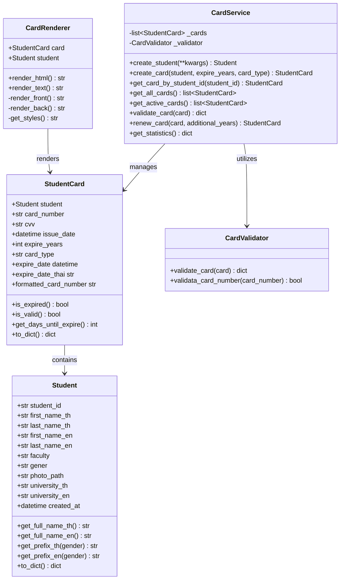

# Student ID Card Management System 🪪
### ระบบจัดการบัตรประจำตัวนักศึกษา - มหาวิทยาลัยราชภัฏนครปฐม

An Object-Oriented Programming (OOP) application implemented in Python for managing, validating, rendering, and simulating Student ID Cards for Nakorn Pathom Rajbhat University.

---

## 🌟 Key Features

- **Robust OOP Architecture**: Follows clean OOP principles with separate concerns for Models, Services, Utilities, and Views (MVC-like structure).
- **Core Models**:
  - `Student`: Captures and manages student attributes (Thai/English names, Student ID, Faculty, Gender, Photo Path, and University).
  - `StudentCard`: Handles credit-card-style properties (16-digit card number, 3-digit CVV, issue/expiry dates, validity, and remaining days).
- **Services & Logic**:
  - `CardService`: Orchestrates student and card creation, renewals, retrieving statistics, and fetching cards.
  - `CardValidator`: Validates data completeness, checks card expiration, triggers warning messages if the card expires in under 30 days, and validates card numbers using the **Luhn Algorithm**.
- **Dual Rendering Modes**:
  - **HTML Render**: Generates a visually stunning, premium-styled, front-and-back mock double-sided student card using HTML & CSS (outputted to `student_card.html`).
  - **ASCII Text Render**: Generates a compact, command-line friendly text table representation of the card.
- **Pre-configured Docker Support**: Easily run the application in an isolated environment.
- **Unit Testing**: Complete unit test coverage for services, student details, and cards using `pytest`.

---

## 📁 Directory Structure

```text
student-card/
├── Dockerfile                  # Container definition
├── pyproject.toml              # Build system & project metadata
├── requirements.txt            # Python dependencies (pinned >= for Python 3.14 compatibility)
├── main.py                     # Entrypoint & demonstration runner
├── src/                        # Source code
│   ├── __init__.py
│   ├── models/                 # Data Models
│   │   ├── __init__.py
│   │   ├── student.py          # Student details
│   │   └── student_card.py     # Student card details
│   ├── services/               # Business Logic Services
│   │   ├── __init__.py
│   │   ├── card_service.py     # Service orchestrator
│   │   └── card_validator.py   # Card and Luhn validation
│   ├── utils/                  # Shared Utilities
│   │   ├── __init__.py
│   │   └── thai_date.py
│   └── views/                  # UI Rendering Layer
│       ├── __init__.py
│       └── card_renderor.py    # HTML and Text UI Renderers
└── tests/                      # Automated Unit Tests
    ├── test_card_service.py    # Card service tests
    ├── test_student.py         # Student model tests
    └── test_student_card.py    # Student card tests
```

---

## 🏗️ System Architecture & Class Design

The system is designed following the **Separation of Concerns (SoC)** principle:



### Component Breakdown
1. **Model Layer (`src/models`)**: Defines the data models using Python's `@dataclass`.
   - `Student` models the physical student.
   - `StudentCard` models the academic smart card associated with a student.
2. **Service Layer (`src/services`)**: Implements business and validation rules.
   - `CardService` manages state storage, retrieval, renewal workflow, and aggregates system statistics.
   - `CardValidator` handles structural checks, expiration alerts, and performs a checksum on the card number using the **Luhn Algorithm**.
3. **Presentation Layer (`src/views`)**: Converts model data into representations.
   - `CardRenderer` produces console outputs as well as customized double-sided visual HTML cards (Front and Back layout with dynamic CSS).

---

## 🚀 Getting Started

### Prerequisites
- Python 3.10 or newer (Fully tested and compatible up to **Python 3.14**)

### Installation

1. Clone or navigate to the project directory:
   ```bash
   cd ~/Desktop/workspace/oop/student-card
   ```

2. Create a virtual environment (optional but recommended):
   ```bash
   python -m venv .venv
   source .venv/bin/activate  # On macOS/Linux
   # or
   .venv\Scripts\activate     # On Windows
   ```

3. Install the dependencies:
   ```bash
   pip install -r requirements.txt
   ```

---

## 💻 Usage

Run the main application file to generate a card simulation and output the HTML preview:

```bash
python main.py
```

### Output Preview:
Running the program prints out the card statistics, displays an ASCII visualization, and produces a `student_card.html` file in your workspace containing a responsive, modern card layout.

---

## 🧪 Testing

The project includes an automated test suite verifying card creation, validation rules, and stats tracking.

Run the tests using `pytest`:

```bash
python -m pytest
```

---

## 🐳 Docker Deployment

You can containerize the application to build and execute it securely:

1. **Build the Docker Image**:
   ```bash
   docker build -t student-card-system .
   ```

2. **Run the Container**:
   ```bash
   docker run --name student-card-runner --rm student-card-system
   ```
